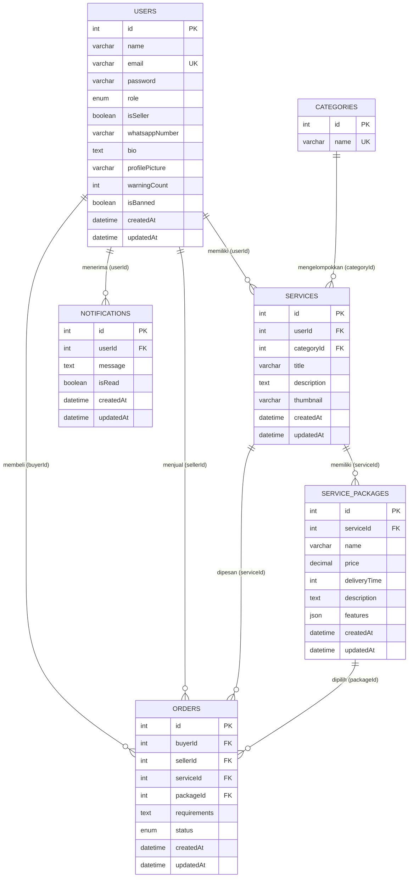
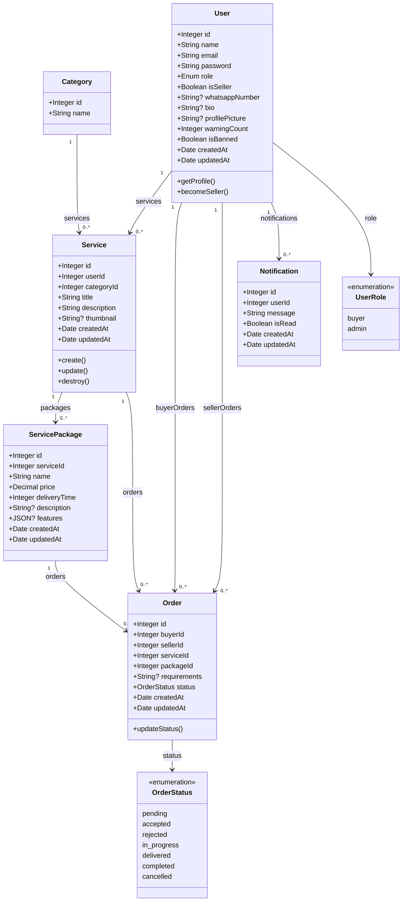
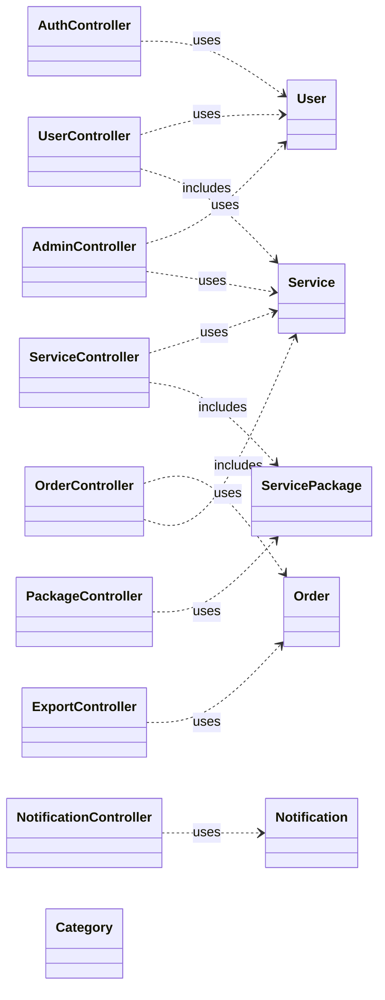

# Dokumentasi ERD & Class Diagram — Sistem ORVIX

| | |
|---|---|
| **Nama Sistem** | ORVIX — Sistem Jasa Digital |
| **Versi** | 1.0 |
| **Disusun oleh** | Muhamad Fathir Rahman |
| **Database** | MySQL (via Sequelize ORM) |
| **Catatan** | Tabel `portfolios` dan `reviews` **tidak digunakan** (dihapus / dinonaktifkan). |

---

# Bagian A — Entity Relationship Diagram (ERD)

## A.1 Diagram Relasi (Crow's Foot)



## A.2 Ringkasan Relasi

| No | Entitas A | Kardinalitas | Entitas B | FK | On Delete | On Update | Keterangan |
|----|-----------|--------------|-----------|-----|-----------|-----------|------------|
| 1 | **users** | 1 : N | **services** | `services.userId` → `users.id` | CASCADE | CASCADE | Satu seller/user punya banyak layanan |
| 2 | **categories** | 1 : N | **services** | `services.categoryId` → `categories.id` | CASCADE | CASCADE | Satu kategori berisi banyak layanan |
| 3 | **services** | 1 : N | **service_packages** | `service_packages.serviceId` → `services.id` | CASCADE | CASCADE | Satu layanan punya banyak paket (Basic/Gold/Pro) |
| 4 | **users** | 1 : N | **orders** | `orders.buyerId` → `users.id` | CASCADE | CASCADE | Buyer pada order |
| 5 | **users** | 1 : N | **orders** | `orders.sellerId` → `users.id` | CASCADE | CASCADE | Seller pada order |
| 6 | **services** | 1 : N | **orders** | `orders.serviceId` → `services.id` | CASCADE | CASCADE | Layanan yang dipesan |
| 7 | **service_packages** | 1 : N | **orders** | `orders.packageId` → `service_packages.id` | CASCADE | CASCADE | Paket yang dipilih buyer |
| 8 | **users** | 1 : N | **notifications** | `notifications.userId` → `users.id` | CASCADE | — | Notifikasi per pengguna |

## A.3 Detail Atribut per Tabel

### Tabel: `users`

| Atribut | Tipe Data (MySQL) | Sequelize | PK | FK | NULL | Default | Unique | Keterangan |
|---------|-------------------|-----------|----|----|------|---------|--------|------------|
| `id` | `INT` | `INTEGER` | ✓ | — | ✗ | AUTO_INCREMENT | — | Primary key |
| `name` | `VARCHAR(255)` | `STRING` | — | — | ✗ | — | — | Nama tampilan |
| `email` | `VARCHAR(255)` | `STRING` | — | — | ✗ | — | ✓ | Login & identitas |
| `password` | `VARCHAR(255)` | `STRING` | — | — | ✗ | — | — | Hash bcrypt |
| `role` | `ENUM('buyer','admin')` | `ENUM` | — | — | ✗ | `'buyer'` | — | Peran sistem; seller = `isSeller` |
| `isSeller` | `TINYINT(1)` | `BOOLEAN` | — | — | ✗ | `false` | — | `true` jika sudah become seller |
| `whatsappNumber` | `VARCHAR(255)` | `STRING` | — | — | ✓ | `NULL` | — | Kontak WA seller |
| `bio` | `TEXT` | `TEXT` | — | — | ✓ | `NULL` | — | Deskripsi profil |
| `profilePicture` | `VARCHAR(255)` | `STRING` | — | — | ✓ | `NULL` | — | Path/URL foto profil |
| `warningCount` | `INT` | `INTEGER` | — | — | ✗ | `0` | — | Jumlah peringatan admin |
| `isBanned` | `TINYINT(1)` | `BOOLEAN` | — | — | ✗ | `false` | — | Status banned |
| `createdAt` | `DATETIME` | `DATE` | — | — | ✗ | — | — | Timestamp dibuat |
| `updatedAt` | `DATETIME` | `DATE` | — | — | ✗ | — | — | Timestamp diubah |

---

### Tabel: `categories`

| Atribut | Tipe Data (MySQL) | Sequelize | PK | FK | NULL | Default | Unique | Keterangan |
|---------|-------------------|-----------|----|----|------|---------|--------|------------|
| `id` | `INT` | `INTEGER` | ✓ | — | ✗ | AUTO_INCREMENT | — | Primary key |
| `name` | `VARCHAR(255)` | `STRING` | — | — | ✗ | — | ✓ | Nama kategori jasa |

*Catatan: tabel ini **tanpa** `createdAt` / `updatedAt`.*

---

### Tabel: `services`

| Atribut | Tipe Data (MySQL) | Sequelize | PK | FK | NULL | Default | Keterangan |
|---------|-------------------|-----------|----|----|------|---------|------------|
| `id` | `INT` | `INTEGER` | ✓ | — | ✗ | AI | Primary key |
| `userId` | `INT` | `INTEGER` | — | ✓ → `users.id` | ✗ | — | Pemilik layanan (seller) |
| `categoryId` | `INT` | `INTEGER` | — | ✓ → `categories.id` | ✗ | — | Kategori layanan |
| `title` | `VARCHAR(255)` | `STRING` | — | — | ✗ | — | Judul layanan |
| `description` | `TEXT` | `TEXT` | — | — | ✗ | — | Deskripsi lengkap |
| `thumbnail` | `VARCHAR(255)` | `STRING` | — | — | ✓ | `NULL` | Path gambar thumbnail |
| `createdAt` | `DATETIME` | `DATE` | — | — | ✗ | — | |
| `updatedAt` | `DATETIME` | `DATE` | — | — | ✗ | — | |

---

### Tabel: `service_packages`

| Atribut | Tipe Data (MySQL) | Sequelize | PK | FK | NULL | Default | Keterangan |
|---------|-------------------|-----------|----|----|------|---------|------------|
| `id` | `INT` | `INTEGER` | ✓ | — | ✗ | AI | Primary key |
| `serviceId` | `INT` | `INTEGER` | — | ✓ → `services.id` | ✗ | — | Layanan induk |
| `name` | `VARCHAR(255)` | `STRING` | — | — | ✗ | — | Tier: **Basic**, **Gold**, **Pro** |
| `price` | `DECIMAL(12,2)` | `DECIMAL(12,2)` | — | — | ✗ | — | Harga paket (Rp) |
| `deliveryTime` | `INT` | `INTEGER` | — | — | ✗ | — | Estimasi hari pengerjaan |
| `description` | `TEXT` | `TEXT` | — | — | ✓ | `NULL` | Detail paket (opsional) |
| `features` | `JSON` | `JSON` | — | — | ✓ | `NULL` | Daftar fitur (array JSON) |
| `createdAt` | `DATETIME` | `DATE` | — | — | ✗ | — | |
| `updatedAt` | `DATETIME` | `DATE` | — | — | ✗ | — | |

---

### Tabel: `orders`

| Atribut | Tipe Data (MySQL) | Sequelize | PK | FK | NULL | Default | Keterangan |
|---------|-------------------|-----------|----|----|------|---------|------------|
| `id` | `INT` | `INTEGER` | ✓ | — | ✗ | AI | Primary key |
| `buyerId` | `INT` | `INTEGER` | — | ✓ → `users.id` | ✗ | — | Pembeli |
| `sellerId` | `INT` | `INTEGER` | — | ✓ → `users.id` | ✗ | — | Penjual layanan |
| `serviceId` | `INT` | `INTEGER` | — | ✓ → `services.id` | ✗ | — | Layanan dipesan |
| `packageId` | `INT` | `INTEGER` | — | ✓ → `service_packages.id` | ✗ | — | Paket dipilih |
| `requirements` | `TEXT` | `TEXT` | — | — | ✓ | `NULL` | Catatan kebutuhan buyer |
| `status` | `ENUM(...)` | `ENUM` | — | — | ✗ | `'pending'` | Lihat nilai ENUM di bawah |
| `createdAt` | `DATETIME` | `DATE` | — | — | ✗ | — | |
| `updatedAt` | `DATETIME` | `DATE` | — | — | ✗ | — | |

**Nilai ENUM `orders.status`:**

| Nilai | Arti bisnis |
|-------|-------------|
| `pending` | Order baru, menunggu respons seller |
| `accepted` | Seller menerima order |
| `rejected` | Seller menolak order |
| `in_progress` | Seller mulai mengerjakan |
| `delivered` | Hasil dikirim, menunggu konfirmasi buyer |
| `completed` | Buyer menyelesaikan order |
| `cancelled` | Order dibatalkan (buyer saat pending) |

---

### Tabel: `notifications`

| Atribut | Tipe Data (MySQL) | Sequelize | PK | FK | NULL | Default | Keterangan |
|---------|-------------------|-----------|----|----|------|---------|------------|
| `id` | `INT` | `INTEGER` | ✓ | — | ✗ | AI | Primary key |
| `userId` | `INT` | `INTEGER` | — | ✓ → `users.id` | ✗ | — | Penerima notifikasi |
| `message` | `TEXT` | `TEXT` | — | — | ✗ | — | Isi pesan |
| `isRead` | `TINYINT(1)` | `BOOLEAN` | — | — | ✗ | `false` | Status dibaca |
| `createdAt` | `DATETIME` | `DATE` | — | — | ✗ | — | |
| `updatedAt` | `DATETIME` | `DATE` | — | — | ✗ | — | |

---

## A.4 Diagram Relasi Teks (Alternatif)

```
categories (1) ──────< (N) services (1) ──────< (N) service_packages
                              │                           │
                              │ userId                    │
                              ▼                           │
users (1) ──────< (N) services                          │
   │                                                    │
   ├──────< (N) orders >────── serviceId ───────────────┤
   │              │                                      │
   │              └────── packageId ────────────────────┘
   │
   ├──────< (N) orders (buyerId)
   ├──────< (N) orders (sellerId)
   └──────< (N) notifications
```

---

# Bagian B — Class Diagram (Domain Model)

Diagram berikut merepresentasikan **kelas model Sequelize** (`Backend/models/`) beserta atribut, tipe data TypeScript-style, asosiasi, dan alias relasi.

## B.1 Diagram Kelas (UML)



## B.2 Detail Kelas & Atribut

### Class: `User`
| Properti | Tipe | Visibility | Keterangan |
|----------|------|------------|------------|
| `id` | `number` (INTEGER) | public | PK |
| `name` | `string` | public | |
| `email` | `string` | public | unique |
| `password` | `string` | public | hashed |
| `role` | `'buyer' \| 'admin'` | public | ENUM |
| `isSeller` | `boolean` | public | flag seller |
| `whatsappNumber` | `string \| null` | public | |
| `bio` | `string \| null` | public | |
| `profilePicture` | `string \| null` | public | |
| `warningCount` | `number` | public | default 0 |
| `isBanned` | `boolean` | public | default false |
| `createdAt` | `Date` | public | |
| `updatedAt` | `Date` | public | |

**Asosiasi (Sequelize):**

| Relasi | Target | Tipe | FK | Alias |
|--------|--------|------|-----|-------|
| hasMany | `Service` | 1 → N | `userId` | `services` |
| hasMany | `Order` | 1 → N | `buyerId` | `buyerOrders` |
| hasMany | `Order` | 1 → N | `sellerId` | `sellerOrders` |
| hasMany | `Notification` | 1 → N | `userId` | `notifications` |

**Metode bisnis (Controller layer):** `getProfile`, `updateProfile`, `becomeSeller`, `getSellerDetail`

---

### Class: `Category`
| Properti | Tipe | Visibility | Keterangan |
|----------|------|------------|------------|
| `id` | `number` | public | PK |
| `name` | `string` | public | unique |

**Asosiasi:**

| Relasi | Target | Tipe | FK | Alias |
|--------|--------|------|-----|-------|
| hasMany | `Service` | 1 → N | `categoryId` | `services` |

---

### Class: `Service`
| Properti | Tipe | Visibility | Keterangan |
|----------|------|------------|------------|
| `id` | `number` | public | PK |
| `userId` | `number` | public | FK → User |
| `categoryId` | `number` | public | FK → Category |
| `title` | `string` | public | |
| `description` | `string` | public | TEXT |
| `thumbnail` | `string \| null` | public | |
| `createdAt` | `Date` | public | |
| `updatedAt` | `Date` | public | |

**Asosiasi:**

| Relasi | Target | Tipe | FK | Alias |
|--------|--------|------|-----|-------|
| belongsTo | `User` | N → 1 | `userId` | `user` |
| belongsTo | `Category` | N → 1 | `categoryId` | `category` |
| hasMany | `ServicePackage` | 1 → N | `serviceId` | `packages` |
| hasMany | `Order` | 1 → N | `serviceId` | `orders` |

**Metode bisnis:** `getAllServices`, `getServiceDetail`, `createService`, `updateService`, `deleteService`

---

### Class: `ServicePackage`
| Properti | Tipe | Visibility | Keterangan |
|----------|------|------------|------------|
| `id` | `number` | public | PK |
| `serviceId` | `number` | public | FK → Service |
| `name` | `string` | public | Basic / Gold / Pro |
| `price` | `number` (Decimal) | public | DECIMAL(12,2) |
| `deliveryTime` | `number` | public | hari |
| `description` | `string \| null` | public | |
| `features` | `object \| array \| null` | public | JSON |
| `createdAt` | `Date` | public | |
| `updatedAt` | `Date` | public | |

**Asosiasi:**

| Relasi | Target | Tipe | FK | Alias |
|--------|--------|------|-----|-------|
| belongsTo | `Service` | N → 1 | `serviceId` | `service` |
| hasMany | `Order` | 1 → N | `packageId` | `orders` |

**Aturan bisnis (helper):** `PACKAGE_TIERS = ['Basic', 'Gold', 'Pro']`

---

### Class: `Order`
| Properti | Tipe | Visibility | Keterangan |
|----------|------|------------|------------|
| `id` | `number` | public | PK |
| `buyerId` | `number` | public | FK → User |
| `sellerId` | `number` | public | FK → User |
| `serviceId` | `number` | public | FK → Service |
| `packageId` | `number` | public | FK → ServicePackage |
| `requirements` | `string \| null` | public | |
| `status` | `OrderStatus` | public | ENUM |
| `createdAt` | `Date` | public | |
| `updatedAt` | `Date` | public | |

**Asosiasi:**

| Relasi | Target | Tipe | FK | Alias |
|--------|--------|------|-----|-------|
| belongsTo | `User` | N → 1 | `buyerId` | `buyer` |
| belongsTo | `User` | N → 1 | `sellerId` | `seller` |
| belongsTo | `Service` | N → 1 | `serviceId` | `service` |
| belongsTo | `ServicePackage` | N → 1 | `packageId` | `package` |

**Metode bisnis:** `createOrder`, `getOrders`, `getOrderDetail`, `updateStatus`, `getSellerStats`

---

### Class: `Notification`
| Properti | Tipe | Visibility | Keterangan |
|----------|------|------------|------------|
| `id` | `number` | public | PK |
| `userId` | `number` | public | FK → User |
| `message` | `string` | public | TEXT |
| `isRead` | `boolean` | public | default false |
| `createdAt` | `Date` | public | |
| `updatedAt` | `Date` | public | |

**Asosiasi:**

| Relasi | Target | Tipe | FK | Alias |
|--------|--------|------|-----|-------|
| belongsTo | `User` | N → 1 | `userId` | `user` |

---

## B.3 Enumeration

### `UserRole`
```
buyer | admin
```
*Seller bukan nilai ENUM terpisah; diwakili oleh `User.isSeller === true`.*

### `OrderStatus`
```
pending | accepted | rejected | in_progress | delivered | completed | cancelled
```

### `PackageTier` (konvensi aplikasi, bukan ENUM DB)
```
Basic | Gold | Pro
```
Disimpan di kolom `service_packages.name` sebagai `VARCHAR`.

---

## B.4 Class Diagram — Lapisan Aplikasi (Ringkas)

Hubungan model domain dengan komponen backend:



| Controller | Model utama yang diakses |
|------------|--------------------------|
| `auth.controller` | `User` |
| `user.controller` | `User`, `Service`, `Category`, `ServicePackage` |
| `service.controller` | `Service`, `User`, `Category`, `ServicePackage` |
| `package.controller` | `ServicePackage`, `Service` |
| `order.controller` | `Order`, `Service`, `ServicePackage`, `User` |
| `notification.controller` | `Notification` |
| `admin.controller` | `User`, `Service`, `Order`, `Notification` |
| `export.controller` | `Order`, `User`, `Service`, `ServicePackage` |

---

## B.5 Mapping ERD ↔ Class Diagram

| Tabel (ERD) | Class (Sequelize) | File Model |
|-------------|-------------------|------------|
| `users` | `User` | `models/user.js` |
| `categories` | `Category` | `models/category.js` |
| `services` | `Service` | `models/service.js` |
| `service_packages` | `ServicePackage` | `models/servicepackage.js` |
| `orders` | `Order` | `models/order.js` |
| `notifications` | `Notification` | `models/notification.js` |

---

## B.6 Entitas yang Tidak Digunakan

| Entitas lama | Status |
|--------------|--------|
| `portfolios` | Tabel di-drop (migrasi `20260603100000-drop-portfolios`) |
| `reviews` | Model dinonaktifkan; tabel di-drop |

---

*Dokumen ini selaras dengan implementasi ORVIX v1.0 (Backend Sequelize + Frontend React). Untuk render diagram Mermaid, gunakan VS Code, GitHub, atau [mermaid.live](https://mermaid.live).*
